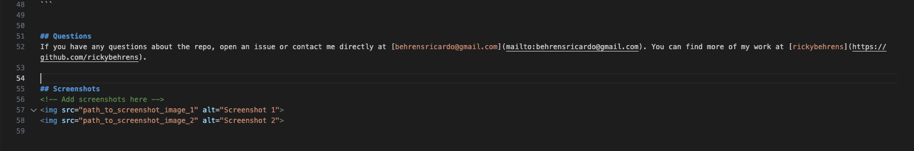

# NodeJS Challenge
[](https://opensource.org/licenses/MIT)

- repo URL: https://github.com/rickybehrens/NodeJS/tree/main
- DEMO Video URL: https://drive.google.com/file/d/1uh7ZS3HjeP4ct_8lzYIZj0KFyR4eEaLx/view?usp=drive_link


## Project Description
Using NodeJS que initialize an application that will create the main frame of a README file for any project.

The application uses the inquirer 8.2.4 package and it is started by typing "node index.js" on the command-line.

Once the application is initialized, there's a set of questions that need to be answered by the user. They are all very straightforward questions with short answers, but once you get to question 5 ("What kind of license should your project have?), the user will have to choose one option from a drop-down list using the arrows in the keyboard.

After this, the next two questions will present the user with a "default" answer that can be overwritten by the user or simply choose the default answer by pressing the "enter" key.

The last question asks the user if he/she would like to include a "Screeshots" section. If the user chooses "NO", the prompt is ended and the README file is created. On the other hand, if the user selects "YES", then a new section is created in the "Table of Contents" and the Screenshots section is created at the bottom of the README file with a placeholder for the image's source.

After the last question is answered, a message appears that says "Generating README file..." and you'll be able to see the new file appear in the repo under the name "README.md". The user needs to be aware that in case there is another README.md file, this generator will overwrite the existing one with the information just answered by the user.

It's very important to understand that this generates the MAIN FRAMEWORK for a professional-looking README file but it's not a finished README file. The user will have to add information to the file constantly as the repo grows and the scope of the project changes or expands.


## Table of Contents
- [Installation](#installation)
- [Usage](#usage)
- [License](#license)
- [Contributing](#contributing)
- [Tests](#tests)
- [Questions](#questions)
- [Screenshots](#screenshots)


## Installation
To install the necessary dependencies, run the following command:
```
npm i
```


## Usage
It's very important to understand that this generates the MAIN FRAMEWORK for a professional-looking README file but it's not a finished README file. The user will have to add information to the file constantly as the repo grows and the scope of the project changes or expands.

After the last question is answered, a message appears that says "Generating README file..." and you'll be able to see the new file appear in the repo under the name "README.md". The user needs to be aware that in case there is another README.md file, this generator will overwrite the existing one with the information just answered by the user.

  
## License
This project is licensed under the MIT license.


Copyright (c) 2023 Ricardo Behrens. All rights reserved.

Permission is hereby granted, free of charge, to any person obtaining a copy of this software and associated documentation files (the "Software"), to deal in the Software without restriction, including without limitation the rights to use, copy, modify, merge, publish, distribute, sublicense, and/or sell copies of the Software, and to permit persons to whom the Software is furnished to do so, subject to the following conditions:

The above copyright notice and this permission notice shall be included in all copies or substantial portions of the Software.

THE SOFTWARE IS PROVIDED "AS IS", WITHOUT WARRANTY OF ANY KIND, EXPRESS OR IMPLIED, INCLUDING BUT NOT LIMITED TO THE WARRANTIES OF MERCHANTABILITY, FITNESS FOR A PARTICULAR PURPOSE AND NONINFRINGEMENT. IN NO EVENT SHALL THE AUTHORS OR COPYRIGHT HOLDERS BE LIABLE FOR ANY CLAIM, DAMAGES OR OTHER LIABILITY, WHETHER IN AN ACTION OF CONTRACT, TORT OR OTHERWISE, ARISING FROM, OUT OF OR IN CONNECTION WITH THE SOFTWARE OR THE USE OR OTHER DEALINGS IN THE SOFTWARE.
  
    
## Contributing
Nothing

  
## Tests
To run tests, run the following command:
```
npm test
```

  
## Questions
If you have any questions about the repo, open an issue or contact me directly at [behrensricardo@gmail.com](mailto:behrensricardo@gmail.com). You can find more of my work at [rickybehrens](https://github.com/rickybehrens).


## Screenshots
<!-- Add screenshots here -->



